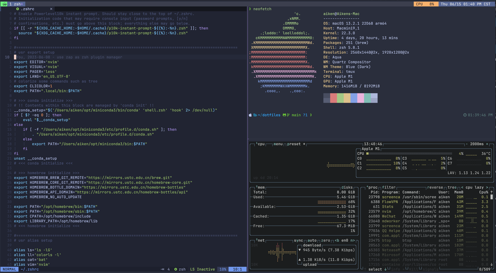

# MY CONFIG FILES



## Installation

You will need `git` and GNU `stow`. Clone into your `$HOME` directory.
(There are some submodules, you need to use --recurse-submodules flag )

```shell
git clone --recurse-submodules https://github.com/aikenji/dotfiles.git 
```

Run `sh install.sh` to symlink all config files into `$HOME` directory,
or just what you want by running

```shell
stow zsh/ # just my zsh config
```

## File Structure

```pre
.
├── init.lua
├── lazy-lock.json
└── lua
    └── aiken
        ├── core
        │   ├── keymaps.lua
        │   └── options.lua
        └── plugins
            ├── alpha.lua
            ├── autopairs.lua
            ├── bufferline.lua
            ├── comment.lua
            ├── gitsigns.lua
            ├── init.lua
            ├── lsp
            │   ├── completion.lua
            │   ├── lsp.lua
            │   ├── lspsaga.lua
            │   ├── null-ls.lua
            │   └── treesitter.lua
            ├── lualine.lua
            ├── neo-tree.lua
            ├── noice.lua
            ├── telescope.lua
            ├── toggleterm.lua
            └── tokyonight.lua
```
