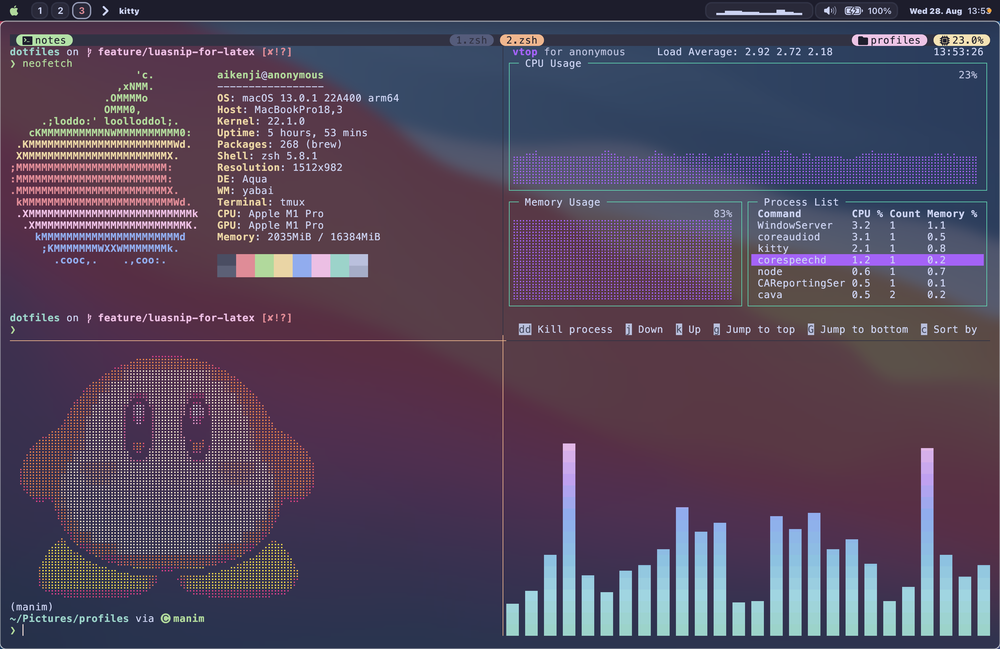
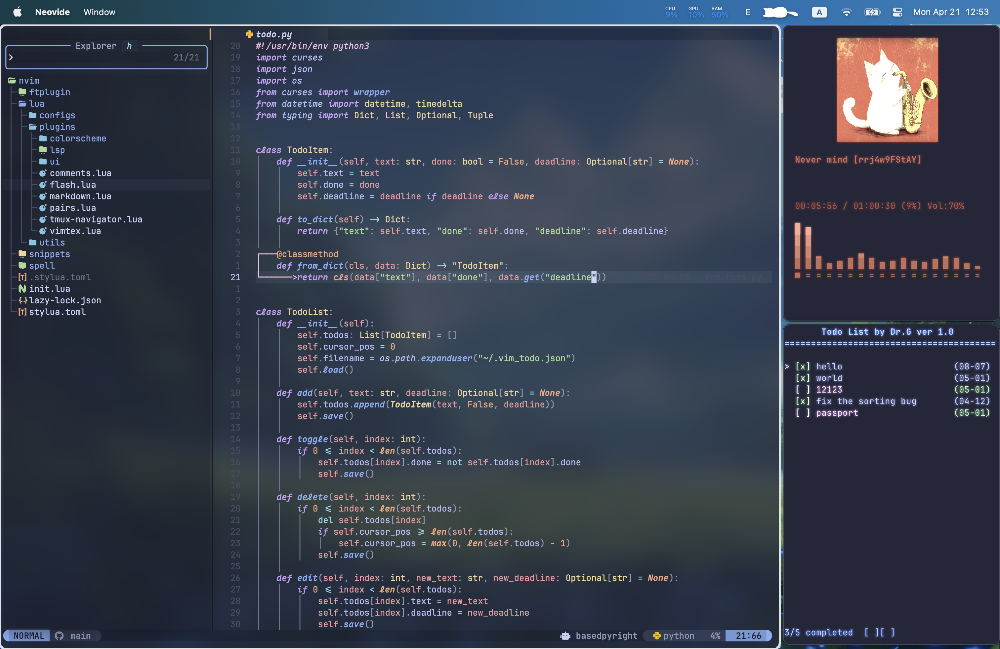

# MY CONFIG FILES




## Installation

You will need `git` and GNU `stow`. Clone into your `$HOME` directory.
(There are some submodules, you need to use --recurse-submodules flag )

Clone dotfiles:

```bash
git clone --recurse-submodules https://github.com/aikenji/dotfiles.git 
```

Run `sh install.sh` to symlink all config files into `$HOME` directory,
or just what you want by running

```bash
stow zsh/ # just my zsh config
```

## Tmux

The config file `tmux.conf` is in `$HOME/.config/tmux`.
The plugins of tmux is managed by TPM.

Clone TPM:

```bash
git clone https://github.com/tmux-plugins/tpm ~/.tmux/plugins/tpm
```

Reload TMUX environment so TPM is sourced:

```bash
# type this in terminal if tmux is already running
tmux source ~/.tmux.conf
```

### install plugins

1. Add new plugin to tmux.conf.
2. Press `prefix + I` to fetch the plugin.

### uninstall plugins

1. Remove the plugin from the list in `tmux.conf`.
2. Press `prefix + alt + u` to remove the plugin.

### update plugins

Press `prefix + U`.

## File Structure of neovim

```pre
 .
├──  ftplugin
│   ├──  markdown.lua
│   └──  tex.lua
├──  init.lua
├──  lazy-lock.json
├──  lua
│   ├──  configs
│   ├──  plugins
│   └──  utils
├──  snippets
│   ├──  all.lua
│   ├──  markdown.lua
│   ├──  math.txt
│   └──  tex
└──  spell
    ├──  en.utf-8.add
    └──  en.utf-8.add.spl
```
